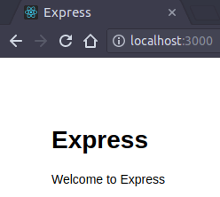

# Express.js to Create Web Application

--------------------------------------------------------------------------------

## Create a basic web app

Oke, lalu bagaimana cara kita membuat atau menyusun aplikasi web yang lengkap?

Yang kita inginkan adalah web yang memiliki tampilan juga.

Dengan Express, ada 2 jalan yang tersedia:

1. Membuat backend (REST API) dahulu lalu membuat frontend (HTML, CSS, JS) dalam sistemnya masing-masing, ataupun dengan urutan sebaliknya
2. Membuat backend dan frontend sekaligus dalam sistem yang sama dan pada waktu yang sama

Di sini sebagai permulaan, kita bisa langsung terjun ke cara kedua.

--------------------------------------------------------------------------------

## Create a full blown web app with generator

Kita bisa meng-generate aplikasi Express lebih instan dengan [Express application generator](https://www.npmjs.com/package/express-generator).

Terima kasih `express-generator`!

```sh
$ npm i -g express-generator
$ express app-name
$ cd app-name && npm install
```

Setelah setup dan instalasi, lalu jalankan:

```sh
$ npm start

> expressjs-web@1.0.0 start /home/yourname/3-EXPRESSJS-WEB
> node ./bin/www
```

Maka aplikasi berjalan di URL `localhost:3000`:

```sh
$ curl localhost:3000

<!DOCTYPE html><html><head><title>Express</title><link rel="stylesheet" href="/stylesheets/style.css"></head>
<body><h1>Express</h1><p>Welcome to Express</p></body></html>%
```

Jalankanlah web-nya di browser.



Di terminal juga akan terlihat log route apa saja yang diakses oleh user:

```sh
GET / 200 201.808 ms - 170
GET / 200 19.655 ms - 170
GET /stylesheets/style.css 200 5.881 ms - 111
GET /favicon.ico 404 31.150 ms - 1745
GET / 200 9.486 ms - 170
...
```

Bukan sulap, bukan sihir!

--------------------------------------------------------------------------------

## Inside generated Express structure (1)

Ketika melihat struktur aplikasi yang dibuat melalui generator, tentu mayoritas orang akan kaget.

Ini apa aja???

```sh
.
├── app.js
├── bin
│   └── www
├── package.json
├── package-lock.json
├── public
│   ├── images
│   ├── javascripts
│   └── stylesheets
│       └── style.css
├── routes
│   ├── index.js
│   └── users.js
└── views
    ├── error.jade
    ├── index.jade
    └── layout.jade
```

Mari kita telaah satu-satu.

Mulai dari `package.json` ya:

```json
...
  "scripts": {
    "start": "node ./bin/www"
  },
...
```

Di sini diketahui bahwa aplikasi dijalankan pertama kali melalui file `./bin/www` yang mana juga adalah file JavaScript tapi tanpa ekstensi `.js`.

Pada bagian awal kode-nya, terlihat bahwa `www` mengimpor file `../app` (atau `../app.js` tanpa ekstensi) sebagai server aplikasi utama.

Tujuan file `www` ini hanyalah untuk konfigurasi semata.

```js
// Module dependencies
var app = require('../app');
var debug = require('debug')('app:server');
var http = require('http');

// Get port from environment and store in Express
var port = normalizePort(process.env.PORT || '3000');
app.set('port', port);

// Create HTTP server
var server = http.createServer(app);

// Listen on provided port, on all network interfaces
server.listen(port);
```

1. Dependency di-load
2. Konfigurasi variabel `PORT`
3. Membuat HTTP server dari dependency
4. Menjalankan server tersebut dengan port yang sudah diatur

Sisanya hanyalah function untuk berbagai kondisi tertentu.

--------------------------------------------------------------------------------

## Inside generated Express structure (2)

Pada aplikasi Express umumnya ada berbagai dependency esensial berikut yang mana sebagian juga merupakan plugin atau middleware untuk Express.

```json
...
"dependencies": {
  "body-parser": "~1.18.2",
  "cookie-parser": "~1.4.3",
  "debug": "~2.6.9",
  "express": "~4.15.5",
  "jade": "~1.11.0",
  "morgan": "~1.9.0",
  "serve-favicon": "~2.4.5"
}
```

* `body-parser` - mem-parsing HTTP request body yang berasal dari client ke server
* `cookie-parser` - mem-parsing HTTP cookie header
* `debug` - utility untuk debugging 
* `jade` (sekarang juga disebut `pug`) - view/template engine untuk menyusun merender HTML yang modular di server, terdapat beberapa file ekstensi `.jade` di project kita
* `morgan` - plugin untuk logging HTTP request
* `serve-favicon` - plugin untuk menyajikan favicon dari server

Untuk lebih lengkapnya bisa lihat satu-satu di `npmjs.com`.

Mulai dari sinilah struktur project hasil generator sangat berperan.

```sh
.
├── app.js # aplikasi utama
├── bin
│   └── www # konfigurasi utama
├── package.json
├── package-lock.json # hanya untuk mengunci versi dependency
├── public # berbagai file static yang disajikan oleh app.js
├── routes # berbagai route yang diimpor dan dijalankan oleh app.js
└── views # berbagai tampilah HTML yang di-render oleh Jade
```

--------------------------------------------------------------------------------

## Inside generated Express structure (3)

Setelah mengetahui hal penting dari apa yang sudah di-generate, sambil melihat `app.js` secara hati-hati, cara kerja utama aplikasinya kurang lebih:

1. `bin/www` mengonfigurasi untuk menjalankan `app.js`

```js
var app = require('../app');
var debug = require('debug')('app:server');
var http = require('http');
```

2. `app.js` mengatur aplikasi secara keseluruhan yang diawali dengan mengimpor berbagai dependency yang sudah diinstal

```js
var express = require('express');
var path = require('path');
var favicon = require('serve-favicon');
var logger = require('morgan');
var cookieParser = require('cookie-parser');
var bodyParser = require('body-parser');
```

4. Mengimpor module route yang ada di `routes`

```js
var index = require('./routes/index');
var users = require('./routes/users');
```

5. Meng-instantiate objek `app` dari `express`

```js
var app = express();
```

6. Mengatur view engine dengan Jade

```js
// view engine setup
app.set('views', path.join(__dirname, 'views'));
app.set('view engine', 'jade');
```

7. Menggunakan berbagai plugin yang diperlukan

```js
// uncomment after placing your favicon in /public
//app.use(favicon(path.join(__dirname, 'public', 'favicon.ico')));
app.use(logger('dev'));
app.use(bodyParser.json());
app.use(bodyParser.urlencoded({ extended: false }));
app.use(cookieParser());
app.use(express.static(path.join(__dirname, 'public')));
```

8. Menggunakan module route yang sudah diimpor agar bisa diakses melalui HTTP request

```js
app.use('/', index);
app.use('/users', users);
```

9. Menangkap error jika perlu

```js
// catch 404 and forward to error handler
app.use(function(req, res, next) {
  var err = new Error('Not Found');
  err.status = 404;
  next(err);
});

// error handler
app.use(function(err, req, res, next) {
  // set locals, only providing error in development
  res.locals.message = err.message;
  res.locals.error = req.app.get('env') === 'development' ? err : {};

  // render the error page
  res.status(err.status || 500);
  res.render('error');
});
```

10. Mengekspor aplikasi ini agar digunakan oleh `bin/www`

```js
module.exports = app;
```

--------------------------------------------------------------------------------

## Live Code

Terdapat live code via [Glitch](https://glitch.me) di <https://glitch.com/~static-express> yang dapat dilihat hasilnya di <https://static-express.glitch.me> dan source code-nya di <https://glitch.com/edit/#!/static-express>.
